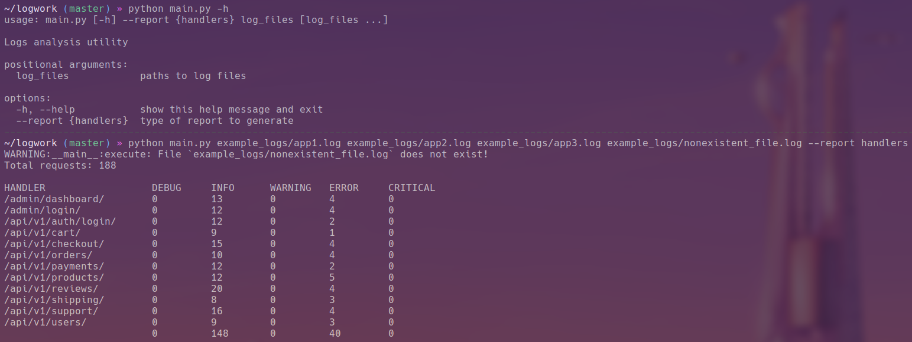
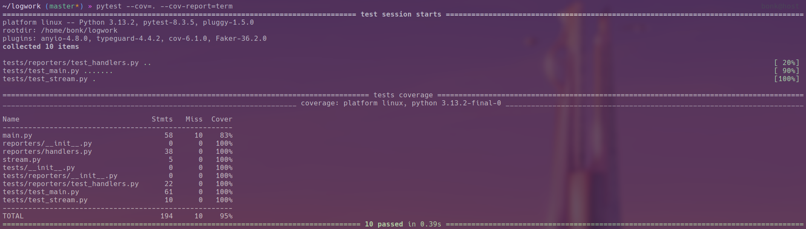

You can also [Read this in English](README_en.md)
# Logwork
Анализ лог-файлов
## Что это такое?
Logwork — это модульное CLI-приложение, которое обрабатывает лог-файлы с помощью модулей ("репортеров"). Модули репортеров содержат логику формирования отчетов. Встроенный репортер `handlers` анализирует записи `django.request` из логов фреймворка Django, подсчитывает количество сообщений по уровням логирования и выводит статистику в виде таблицы. Примеры лог-файлов включены в репозиторий в директории `example_logs`.
### Особенности
- Модульная архитектура;  
- Подробная документация;
    - Обратите внимание, что документация кода представлена на Английском языке.
- Поддержка многопроцессорной обработки.
## Добавление репортеров
Logwork спроектирован для простого расширения. Чтобы добавить репортер, нужно лишь поместить его в директорию `reporters/` и добавить его в перечисление `ReportTypes`.
### Спецификация репортера
Репортер должен содержать как минимум два модуля — `process_reports` и `assemble_output`:

- `process_reports` должен принимать аргументы `generator` (`Generator[str, None, None]`) и `queue` (`Queue`).  
    - `generator` ссылается на генератор `stream_file` в `stream.py`, который построчно возвращает лог.  
    - `queue` — это очередь, куда нужно поместить результат функции.
    - В очередь необходимо вернуть словарь. Например:
    ```
        {
            "/example1/": {"INFO": 20, "ERROR": 10}, 
            "/example2/": {"INFO": 15, "ERROR": 5}
        }
    ```

- `assemble_output` должен принимать аргумент `data` (dict — см. формат выше) и возвращать строку. Эта строка будет выведена в консоль как результат работы программы.
### Добавление репортера
- Репортеры необходимо класть в директорию `reporters/` с произвольным именем.  
- Репортеры должны быть зарегистрированы в перечислении `ReporterTypes` в файле `main.py`.
  - Имя элемента Enum является псевдонимом репортера — это аргумент, который необходимо передать через `--report`, чтобы вызвать его.  
  - Значение Enum — путь к репортеру. Если он находится в директории `reporters/`, путь будет выглядеть как `reporters.<имя>` (без суффикса `.py`).
## Запуск
- `git clone https://github.com/ThatOneBonk/Logwork.git`
- `python main.py <пути к лог-файлам> --report <название репортера>`
### Скриншоты-примеры


